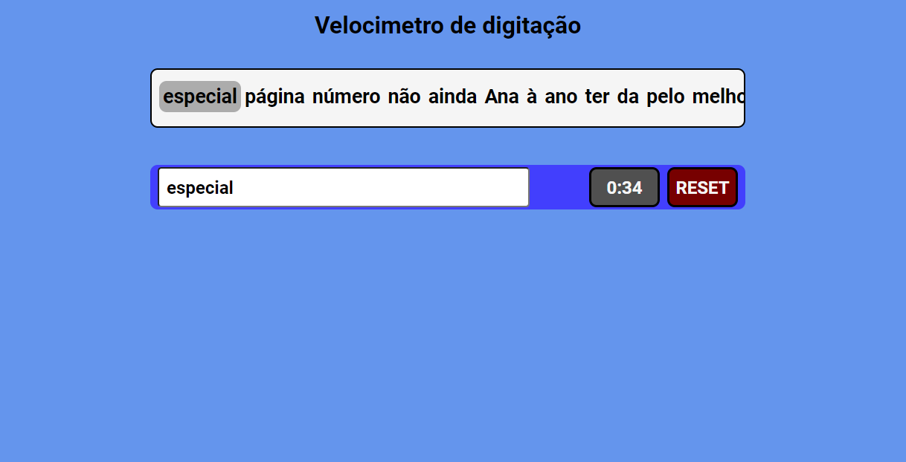
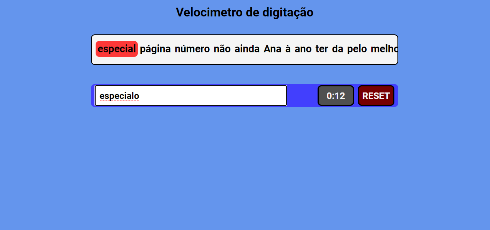
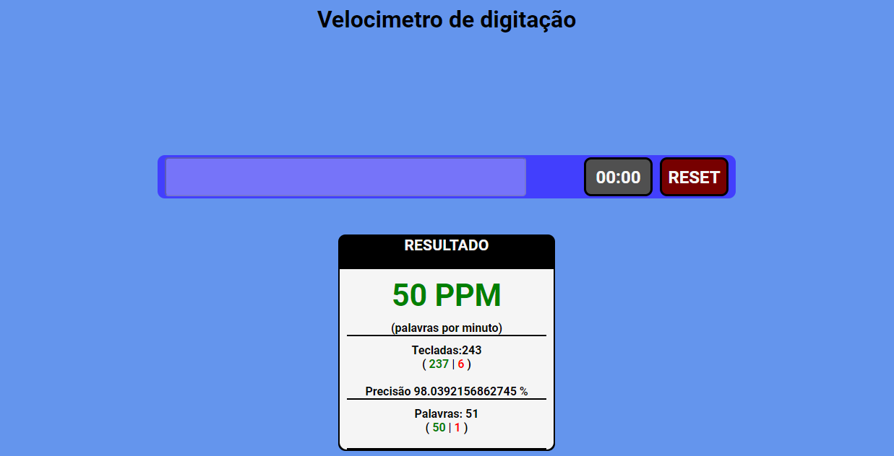

<h1 align="center">Velocimetro de digitação</h1>

<h2 align="center">Veja a quantidade de palavras que você consegue digitar em 1 minuto.</h2>

<strong><a href="https://caiohenriquemachado.github.io/PomodoroClock-project/index.html">ACESSAR SITE</a></strong>

 

<h1 align="center">Web responsive Version </h1>

  

 

  

 

  

 

 
  <h2 align="center">FEATURES :book:</h2>
 

- 🟠 **HTML5** 		      - Para construir a estrutura do site.
- 🟣 **CSS3** 	        - Para a estilização e personalização das estruturas no site.
- 🟡 **JavaScript**     - Para inserir lógica.

 